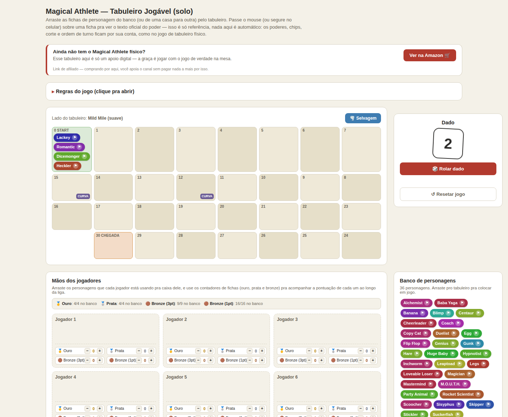

# 🏁 Magical Athlete — Tabuleiro Jogável (apoio digital)

Uma ferramenta web gratuita, em português, pra acompanhar partidas **físicas** do jogo de
tabuleiro *Magical Athlete*. Não precisa instalar nada nem criar conta: é uma única página
HTML que roda 100% no navegador, inclusive offline depois de carregada.

**🔗 Acesse aqui:** https://dados-em-jogo.github.io/dados-em-jogos.github.io/

---

## O que essa ferramenta faz

Ela **não substitui o jogo físico** — é um painel de apoio visual pra organizar a mesa,
parecido com um placar digital. Ela não aplica poderes automaticamente, não sabe quem
"venceu" a corrida e não impõe ordem de turno: isso tudo continua por conta do grupo, como
numa partida normal.

Funcionalidades:

- **Tabuleiro com drag-and-drop** — arraste fichas do banco de personagens (ou de uma casa
  pra outra) usando mouse ou toque, direto no celular ou no computador.
- **Banco de 36 personagens**, cada um com cor própria e o texto oficial do poder em
  português, disponível ao passar o mouse (ou segurar o dedo) sobre a ficha.
- **Flag de "caído" (tripped)** — clique no ⚑ de qualquer ficha em jogo pra marcar/desmarcar
  ela como caída; a ficha fica esmaecida enquanto marcada.
- **Botão de personagem aleatório → Casa 0** — pra sortear rapidamente quem começa a
  corrida sem precisar arrastar manualmente.
- **Dado virtual** com histórico de rolagens.
- **6 "mãos de jogador"** — espaços pra guardar o time (draft) de cada jogador ao longo da
  liga.
- **Contadores de fichas de pontuação** (ouro, prata, bronze 3pt e bronze 1pt) por jogador,
  com o total restante no banco.
- **Modo Mild Mile / Wild Wilds** — um botão alterna entre os dois lados do tabuleiro
  físico, revelando os nomes fixos das casas especiais (curva, avance, recue, estrela,
  tropeçar) de cada lado.
- **Regras completas embutidas**, em português, incluindo draft, ordem de resolução de
  poderes simultâneos, sistema de fichas, glossário de termos e variantes para 2–3
  jogadores — tudo direto na página, sem precisar abrir o manual em PDF.
- **Botão "Resetar jogo"** — volta todas as fichas pro banco e limpa dado, contadores e
  histórico de uma vez.

## Como usar

1. Abra o link do GitHub Pages (ou baixe o `tabuleiro_jogavel.html` e abra ele direto no
   navegador — funciona sem servidor, sem internet e sem instalação).
2. Monte as mãos de cada jogador arrastando os personagens do banco pras caixas de
   "Mãos dos jogadores".
3. Durante a corrida, arraste os personagens em jogo pro tabuleiro e vá movendo as fichas
   conforme o resultado do dado.
4. Ao final de cada corrida, ajuste os contadores de fichas de cada jogador manualmente.
5. Use o botão "Resetar jogo" pra preparar a próxima corrida ou uma nova liga.

> **Nota:** como é uma página estática sem armazenamento, o estado do tabuleiro (fichas,
> contadores, histórico) **não é salvo entre sessões** — se você recarregar ou fechar a
> aba, tudo volta ao zero. Foi feito assim de propósito pra ser simples e não depender de
> conta, login ou backend.

## Tecnologia

Um único arquivo HTML autocontido: HTML + CSS + JavaScript puro (vanilla), sem
frameworks, sem build step e sem dependências externas. O drag-and-drop usa
[Pointer Events](https://developer.mozilla.org/docs/Web/API/Pointer_events) pra funcionar
igual em mouse e toque.

## Publicando no GitHub Pages

1. Suba os arquivos da raiz deste projeto (incluindo `index.html` e a pasta `docs/`, se
   quiser manter o screenshot) pra um repositório no GitHub.
2. Em **Settings → Pages**, escolha a branch (geralmente `main`) e a pasta raiz (`/`).
3. **Importante:** o GitHub Pages usa `index.html` como página inicial do site quando ele
   existe na raiz — só cai pro `README.md` (renderizado com o tema do `_config.yml`) se
   não houver nenhum `index.html`. Por isso o tabuleiro em si é o arquivo `index.html`
   deste projeto (uma cópia idêntica do `tabuleiro_jogavel.html`); o README continua
   servindo como documentação do repositório, visível em github.com, mas não é mais o
   que abre no link do site.

## Aviso legal

*Magical Athlete* é um jogo de tabuleiro de terceiros; este projeto é feito por fã
(**não oficial**) e não tem qualquer afiliação com a editora ou os criadores originais do
jogo. Nenhuma arte ou componente oficial do jogo é reproduzido aqui — as fichas usam cores
geradas por código, e os textos de regras/poderes são resumos e traduções não-oficiais
criados pra uso de apoio à mesa.

A página contém um link de afiliado da Amazon (programa de afiliados) para quem quiser
comprar o jogo físico; isso é sinalizado na própria página, e não gera nenhum custo extra
pra quem compra.

## Licença

Código livre para uso, cópia e modificação. Se for reaproveitar em outro projeto, um
crédito é sempre bem-vindo, mas não é obrigatório.
